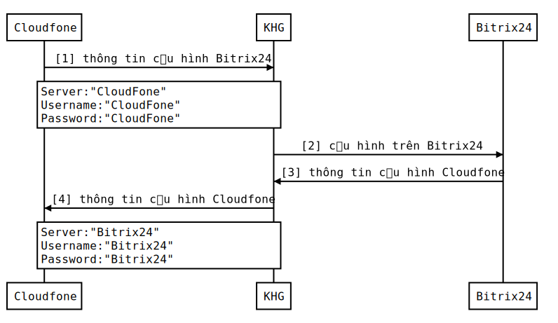

# **Tài liệu Tích Hợp CloudFone với Bitrix24**

## Sơ Đồ :

----

## Cấu hình kết nối trên Bitrix24:

### 1. Trong Phần "Telephony", Chọn Connect \> Chọn tiếp Connect your PBX using SIP connector.

### 2. Tiếp tục chọn Connect office PBX.

### 3. Điền Thông tin Vào from.
> 
> * Connection name: Tên Của Kết nối ví dụ: `To-CloudFone`
> * Server Address: **Thông tin CloudFone cung cấp**
> * Login: **Thông tin CloudFone cung cấp**
> * Password: **Thông tin CloudFone cung cấp**
### 4. Chọn `Connect` Và gửi thông tin kết nối cho Cloudfone.

----
